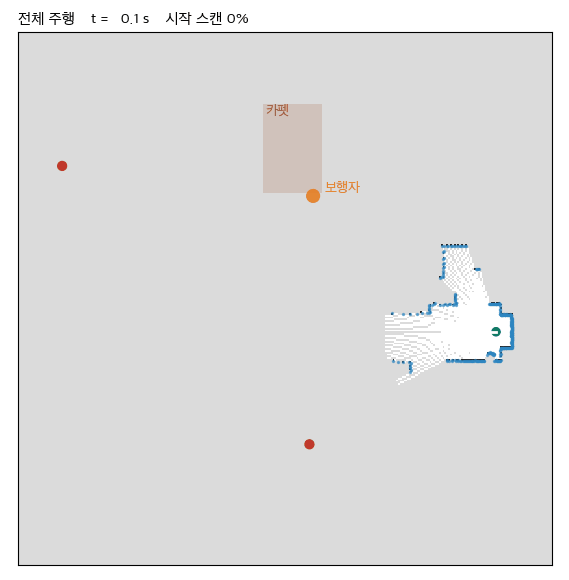

# 특명: 집 나간 빨간 사과 찾아오기

**2026 부산대학교 TECH WEEK 해커톤 — Autonomous Mobile Robot 의 Search & Rescue**
팀 **로봇이아닙니다** · 안준영 · 배준호 · 송지윤

> A TurtleBot3 in Webots explores an apartment it has never seen — no GPS, no prior map — finds the red apples, visits them, and returns to where it started.
> It uses wheel odometry + compass with fine scan matching, a log-odds occupancy grid, frontier exploration that also tracks what the camera has seen, A* and DWA, a two-distance camera check plus YOLO to tell apples from fire extinguishers and cans, and Kalman-tracked pedestrian avoidance.
> Three teammates' approaches are kept side by side as branches (see "팀원과 브랜치").



## 결과

| 항목 | 발표본 기록 (9/30, 대회와 같은 배경 조명, 보행자 있음) |
|---|---|
| 빨간 사과 | **2 / 2 방문** |
| 복귀 | 609.1초에 복귀, 시작점까지 실제 **0.22 m** |
| 위치 추정 오차 | 최대 8.9 cm |
| 보행자 접촉 | 0초 |
| 바닥 과일·캔 밀어냄 | 0 / 8 |

같은 설정을 세 번 돌려 두 번 2/2 였다. 결과가 실행마다 갈린다 — 보행자 위상이 한 스텝만 어긋나도
경로가 달라진다 (`docs/측정_기록.md` §0). 2026-10-04 에 다시 돌린 실행은 **1/2** (화장실 사과 방문,
거실 구석 사과 놓침), 489.5초 복귀, 실제 0.23 m 였다. 발표본과 판단 코드가 같은 코드로 한 번, 이 저장소를
새로 clone 해 `./setup.sh` 만 거친 main 으로 한 번 돌렸는데, 두 실행의 매 틱 궤적 기록(7,648틱)이
바이트까지 같았다.

## 임무와 제약

- 시작점에서 출발해 빨간 사과를 찾아 가까이 간 뒤 시작점으로 돌아온다.
- 지도는 주어지지 않는다. GNSS·절대 위치는 쓸 수 없다 (시작 위치·방향만 안다). 기본 로봇 속도를 넘지 않는다.
- 대회 월드: 주최 측 저장소 [kyu-rae-kim/PNU-TECHWEEK-260930](https://github.com/kyu-rae-kim/PNU-TECHWEEK-260930)
  (커밋 `383de18`)의 `worlds/apartment.wbt` — Webots R2025a, TurtleBot3 Burger, 64 ms, 사과 7개(빨강 2), 보행자 1명(0.2 m/s).

## 어떻게 움직이나

```
SCAN → EXPLORE ⇄ APPROACH → (SWEEP) → RETURN → DONE
```

| 단계 | 하는 일 | 코드 |
|---|---|---|
| 위치 추정 | 바퀴 엔코더 + 나침반 오도메트리, 거리장 위 정밀 스캔 매칭(x·y 만), 바퀴 회전과 나침반 회전이 어긋나면 미끄러짐으로 보고 후진 | `sar/localization.py` `sar/scanmatch.py` `sar/mission.py` |
| 지도 | LiDAR 광선을 5 cm 격자에 log-odds 로 누적. 카메라가 본 칸을 따로 기억 | `sar/mapping.py` |
| 인지 — 사과 | 빨강 HSV → 덩어리 → **카메라 한 장으로 거리를 두 번** (크기·바닥) 재서 맞는 것만 → 모양 → YOLO 확인 | `sar/detect.py` `sar/yolo_check.py` |
| 인지 — 사람 | 지도에 없는 덩어리 + 다리 모양 → 움직임 투표 → 등속 칼만 추적 | `sar/people.py` |
| 계획 | 프론티어(+카메라 미관측 구역)를 고르고 A* — 벽을 로봇 크기만큼 부풀리고 사람 둘레를 비싸게 | `sar/exploration.py` `sar/planner.py` |
| 제어 | DWA — (전진, 회전) 후보 119개를 1.2초 모의주행해 최선을 고른다. 눌리면 트인 쪽으로 탈출 | `sar/follower.py` |
| 판단 | 위 상태 머신. 시간 예산이 복귀에 필요한 시간에 닿으면 찾은 것만 들고 돌아간다. 지도에 길이 없으면 지나온 길을 되짚는다 | `sar/mission*.py` |

모든 판단 코드는 Webots 없이 돈다 (`sar/sensors.py` 만 Webots 를 안다). 왜 이 값들인지는
[`docs/측정_기록.md`](docs/측정_기록.md), 식과 원리는 [`docs/로봇_두뇌_쉽게_설명.md`](docs/로봇_두뇌_쉽게_설명.md).

## 팀원과 브랜치

| 사람 | 브랜치 | 출발 시점 | 한 일 |
|---|---|---|---|
| 안준영 ([@ahnjun0](https://github.com/ahnjun0)) | `main` | — | 파이프라인 전체(위치 추정·지도·탐색·계획·주행·사과·사람), 대회 당일 적응, 발표 |
| 배준호 ([@liebe1127](https://github.com/liebe1127)) | `bae-junho` | 9/30 19:38 | 탐색 중에도 빨간 단서를 먼저 확인하러 간다. LiDAR 평면 높이로 사과와 소화기를 가른다 |
| 송지윤 ([@yun110w](https://github.com/yun110w)) | `song-jiyun` | 9/30 17:32 | 보행자가 다가오면 비켜 선다 (EVADE). 윤곽 모양으로 사과를 가른다 |

### 같은 문제, 세 가지 풀이 — "소화기를 사과로 착각한다"

첫 완주에서 로봇은 시작점 옆 소화기를 사과로 확정하고 찾아갔다 (0/2). 셋이 각자 다른 단서로 풀었다.

| 누구 | 단서 | 방법 |
|---|---|---|
| 안준영 | **카메라 기하** | 크기로 잰 거리와 바닥 접점으로 잰 거리가 30% 안에서 맞아야 바닥의 지름 10 cm 공이다. 세로/가로 비율과 YOLO 로 한 번 더 거른다 |
| 배준호 | **LiDAR 높이** | LiDAR 는 높이 0.173 m 평면만 본다. 같은 방위의 LiDAR 가 카메라 거리와 비슷한 곳에 맞으면 키가 큰 물체(소화기)이고, 비었거나 훨씬 먼 벽만 맞으면 평면 아래의 사과다 |
| 송지윤 | **윤곽 모양** | 꼭지를 지운 원형도(≥ 0.75), 밑면 폭(공은 바닥에 한 점으로 닿는다), 실제 높이(5~13 cm) |

### 각자 잰 결과

결과는 서로 다른 코드 시점·실행에서 나왔으므로 나란히 비교하지 않는다.

- **안준영** — 위 "결과" 절. 발표본(`presentation-2026-09-30`) 기준.
- **배준호** — 본인 커밋 메시지의 측정 (apartment, `bae-junho` 브랜치 코드): 그전까지 한 번도 못 찾던 **거실
  구석 사과**(-12.02, -3.02)를 296.3초에 방문, 복귀 오차 25 cm. 화장실 사과는 놓쳤다. 테스트 397개 통과.
- **송지윤** — 본인 실행 기록 1회 (apartment, `song-jiyun` 브랜치 코드): **화장실 쪽 사과**(-5.15, -10.49) 방문,
  436.5초 복귀, 오차 25 cm. 비키기(EVADE)가 226틱 동안 작동했다. 테스트 414개 통과.

배준호의 브랜치는 발표본이 놓치곤 하는 거실 구석 사과를, 송지윤의 실행은 화장실 사과를 찾았다 — 서로를
보완한다. 다만 둘 다 **발표본보다 앞선 시점**에서 갈라져 그 뒤 들어간 개선(정밀 스캔 매칭·미끄러짐 감지·큰
경계 가산점 등)이 없다.

### 브랜치 돌리는 법과 합칠 때

- 팀원 브랜치와 발표본 태그는 그 시점의 코드 그대로다 (공개할 수 없는 주최 측 자료와 YOLO 가중치만 뺐다).
  돌리는 법은 [발표본 Release 설명](https://github.com/ahnjun0/pnu-techweek26-apple-rescue/releases/tag/presentation-2026-09-30)에 있다.
- 합쳐 본 결과 (발표본 기준): 배준호 → 충돌 없음, 테스트 398개 통과. 송지윤 → `detect.py` 1곳·테스트 1곳 충돌.
  둘 다 → 같은 자리(소화기 거르기)라 `detect.py` 3곳 충돌.

## 설치와 실행

준비물: macOS + **Webots R2025a** (`/Applications/Webots.app`) + [uv](https://docs.astral.sh/uv/).

```bash
git clone https://github.com/ahnjun0/pnu-techweek26-apple-rescue.git && cd pnu-techweek26-apple-rescue
./setup.sh
```

`setup.sh` 가 하는 일 (처음 한 번 몇 분):
1. `uv sync` → `.venv` (numpy · OpenCV · matplotlib · torch · ultralytics, `uv.lock` 고정)
2. `controllers/*/runtime.ini` 에 `.venv` 절대경로 — Webots 전역 설정을 건드리지 않는다
3. 주최 측 저장소(`external/`), 사과 PROTO(`protos/`), YOLO11n 가중치(`models/YOLO/`)를 받는다
4. 라이브러리·가중치·Webots 설치 확인
5. Webots 에셋 미러(약 590 MB)를 받고, 주최 측 `apartment.wbt` 에서 채점 월드 셋을 만든다

| 무엇 | 어떻게 |
|---|---|
| 채점하며 눈으로 보기 (대회 조건) | Webots 로 `worlds/apartment_competition_check.wbt` 를 연다 — Webots 에셋 캐시가 필요하다 |
| 인터넷 없이 | `worlds/apartment_check.wbt` (에셋을 로컬 미러에서) |
| 보행자 없이 | `worlds/apartment_nopeople_check.wbt` |
| 채점만 (헤드리스) | `./run_headless.sh` — 결과 요약과 `debug/out/` 의 기록(궤적·지도·녹화) |
| 테스트 | `uv run pytest tests/ -q` (빠른 것, 몇 초) · `-m slow` (가짜 월드에서 임무 전체) |
| 규칙 검사 | `./check_rules.sh` — 주행 코드에 GPS·Supervisor 가 없는지 등 |
| 재생 비교 | `SAR_RECORD=rec.pkl.gz ./run_headless.sh` 로 녹화하고 `uv run python debug/replay_check.py rec.pkl.gz` |

## 저장소 구조

```
sar/            판단·인지 코드 (Webots 의존은 sensors.py 하나)
controllers/    sar_controller(주행), mission_check(주행 + 채점), 측정 실험 셋
debug/          채점(mission_check, truth), 측정 근거 실험, 재생 비교(replay_check)
tools/          setup 보조 — 주최 측 자료 받기, 에셋 미러, 채점 월드 만들기
tests/          pytest (가짜 월드 포함)
worlds/         측정 실험 월드 (채점 월드는 setup 이 만든다)
docs/           설명서, 기술 해설, 측정 기록, 발표 자료
```

## 버전

```
9/30 17:32 스냅숏 ──┬── song-jiyun   (송지윤)
9/30 19:38 스냅숏 ──┼── bae-junho    (배준호)
9/30 22:04 발표본 ──┴── main: 다듬기 …
   └ tag presentation-2026-09-30
```

- **발표본** (`presentation-2026-09-30`): 대회에서 발표한 코드 그대로.
- **main**: 발표본을 대회 설정 하나로 다듬은 코드 — 연습 단계 설정·꺼진 옵션·연습 도구를 지우고 `sar/` 패키지로
  묶고 주석을 정리했다. 다듬는 커밋마다 녹화한 대회 실행을 다시 넣어 틱마다 같은 출력임을 확인했고
  (`debug/replay_check.py`), 마지막에 새 clone 의 main 을 Webots 로 돌려 궤적이 발표본 코드와 바이트까지
  같음을 확인했다. 녹화 재생은 판단 코드의 약 90% 를 지나간다 (둘러보기·접근 일부는 테스트가 맡는다).

## 알려진 약점

- **결과가 실행마다 갈린다.** 거실 구석 사과로 가는 길이 열리지 않으면 307초 전후에 탐색을 포기하고 1/2 로
  돌아온다 (§결과). 배준호의 단서 우선 방식이 이 사과를 찾았다.
- 카펫(두께 2 cm) 가장자리에서 바퀴가 걸린다 — 미끄러짐 감지로 빠져나오지만 미리 피하지는 못한다 (LiDAR 에 안 보인다).
- 넓은 통로에서도 DWA 가 좌우를 번갈아 골라 맴도는 구간이 있다 (19구간 중 15구간은 전진 후보가 100% 안전했다
  — 여유가 아니라 방향 선택 문제).

## 문서

| 문서 | 내용 |
|---|---|
| [`docs/로봇_두뇌_쉽게_설명.md`](docs/로봇_두뇌_쉽게_설명.md) | 처음 보는 사람을 위한 설명 — 위치 추정부터 복귀까지 |
| [`docs/발표_기술해설.md`](docs/발표_기술해설.md) | 한 틱 동안 무엇을 계산하는가 — 식, 값, 근거, 예상 질문 (9/30 18:51 판) |
| [`docs/기술_질의응답.md`](docs/기술_질의응답.md) | 강사 질문 네 가지 — 위치 추정, GNSS·절대 위치, 속도 제어, 경로 계획 |
| [`docs/측정_기록.md`](docs/측정_기록.md) | 무엇을 재서 무엇을 정했나, 해 보고 뺀 것 |
| [`docs/발표/`](docs/발표/) | 발표 자료(PPTX)·대본·GIF·수식 그림과 그 생성 스크립트 |

## 라이선스와 출처

- 이 저장소의 코드와 문서: **AGPL-3.0** ([LICENSE](LICENSE)). YOLO 확인에 쓰는
  [Ultralytics](https://github.com/ultralytics/ultralytics) 가 AGPL-3.0 이라 같은 라이선스로 둔다.
- 포함하지 않고 `./setup.sh` 가 받는 것:
  - 주최 측 자료 — [kyu-rae-kim/PNU-TECHWEEK-260930](https://github.com/kyu-rae-kim/PNU-TECHWEEK-260930) (라이선스가 명시돼
    있지 않아 재배포하지 않는다). 사과 PROTO 와 채점 월드의 원본 `apartment.wbt` 가 여기서 온다.
  - YOLO11n 가중치 — Ultralytics 릴리스.
  - Webots R2025a 에셋 — [Cyberbotics](https://github.com/cyberbotics/webots) (TurtleBot3 Burger, LDS-01, 아파트 소품).
- 발표 GIF 는 주최 측 apartment 월드를 우리 실행으로 렌더한 화면이다.
- 개발에는 Claude Code 를 보조로 썼다.
